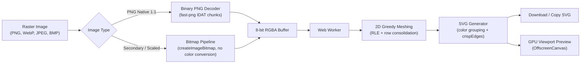

# svg-upscale

Client-side raster-to-SVG vectorization engine with exact spatial and color parity (Delta E = 0), 2D greedy meshing, and zero OS color-space conversion.

[](https://github.com/awhipp/svg-upscale/actions/workflows/deploy.yml)
[](https://opensource.org/licenses/MIT)
[](https://www.typescriptlang.org/)
[](https://react.dev/)
[](https://vitejs.dev/)

---

## Overview

Traditional autotracers like Potrace or AutoTrace approximate raster graphics by fitting Bezier splines. While that works for freeform photographic silhouettes, it breaks down for technical assets, icons, typography, and pixel art:

1. **Contour smoothing**: Sharp corners get rounded, fine details melt, and small pixel patterns distort.
2. **Color drift (Delta E > 0)**: Canvas rendering blits through host GPU pipelines that force OS display gamut conversions (such as sRGB to Display P3) and alpha premultiplication.
3. **Seam artifacts**: Adjacent vector paths anti-alias against each other, creating visible grid lines and halos.
4. **Server dependency**: Most online tools require uploading private assets to a remote backend.

This tool runs entirely in the browser. It parses image bytes directly, performs run-length and 2D meshing, and emits standalone SVG markup with exact color definitions and `shape-rendering="crispEdges"`.

---

## Comparison with Traditional Tools

| Feature | Tracing Tools (Potrace, etc.) | HTML5 Canvas Blit | svg-upscale |
| :--- | :--- | :--- | :--- |
| **Color Fidelity** | Quantized / lossy palette | Delta E > 0 (OS gamut conversions) | **Delta E = 0 (exact 8-bit RGBA)** |
| **Decoding Pipeline** | Server binary or Wasm | Browser GPU composite | **Direct binary PNG IDAT parsing** |
| **Alpha Channel** | Thresholded or discarded | Premultiplied by compositor | **Unmultiplied discrete alpha** |
| **Seams / Halos** | Edge anti-aliasing gaps | N/A (Raster) | **`crispEdges` + 2D greedy meshing** |
| **Element Compaction** | Thousands of overlapping splines | N/A (Raster) | **Greedy meshing + color-grouped `<path>`** |
| **Privacy** | Often uploads to cloud servers | Main thread execution | **100% client-side Web Worker** |

---

## Features

* **Lossless Color Parity (Delta E = 0)**: Bypasses browser canvas gamut mapping for PNG files by decoding raw IDAT datastreams directly in pure JavaScript. Every pixel preserves its original hex code and alpha channel.
* **2D Greedy Meshing**: Merges horizontally and vertically adjacent identical pixels into multi-height rectangles. This prevents 1-pixel scanline fragmentation and cuts element count substantially.
* **Color-Grouped `<path>` Markup**: Groups all subpaths sharing the same color into consolidated SVG `<path>` elements, reducing file size by 50% to 90% compared to individual `<rect>` tags.
* **Resolution Pre-Scaler**:
  * **Digital / Screens**: Standard HD (1280px), Full HD (1600px), Ultra 2K (2048px), Compact Web (800px).
  * **Print / Large Format**: Letter 8.5" x 11" @ 300 DPI (2550px), Table Covers / Banners (3840px), Conference Backdrop (6144px).
  * **Native 1:1**: Unscaled raw pixel grid for pixel art and icons.
  * **Resampling Filters**: Smooth bilinear for continuous tones, or nearest-neighbor for hard pixel edges.
* **60 FPS Interactive Viewport**: Smooth pan and zoom up to 32x, with an interactive split-screen slider comparing the source raster against the vector output. Automatically falls back to an OffscreenCanvas GPU preview texture for large SVGs (>2MB) to prevent UI thread lockup.
* **Desktop Vector Compatibility**: Exported `.svg` files are standard XML and import cleanly into Figma, Adobe Illustrator, Affinity Designer, and Inkscape.
* **Client-Side Privacy**: All processing occurs locally in a Web Worker. No assets leave your machine.

---

## Architecture



### Module Breakdown

* [`src/engine/decoder.ts`](src/engine/decoder.ts): PNG header detection, fast-png chunk decoding, channel normalization (RGB, grayscale, 16-bit to 8-bit), boundary validation, and unmanaged `createImageBitmap` fallback.
* [`src/engine/rle.ts`](src/engine/rle.ts): 32-bit integer scanline compression, 2D greedy meshing for multi-height rectangles, and transparent pixel skipping.
* [`src/engine/svg.ts`](src/engine/svg.ts): SVG markup assembly, hex lookup table formatting, alpha-to-opacity conversion, and color-grouped subpaths.
* [`src/engine/pipeline.ts`](src/engine/pipeline.ts): Pipeline execution, latency timing, and OffscreenCanvas preview texture generation.
* [`src/engine/worker.ts`](src/engine/worker.ts): Dedicated Web Worker context with Transferable `ArrayBuffer` objects for off-main-thread processing.
* [`src/components/`](src/components/): React 19 UI layer (`DropZone`, `OptimizationSettings`, `StatsDashboard`, `Toolbar`, `PreviewPane`).

---

## Development

### Prerequisites

* Node.js 20.x or 22.x
* npm 10.x+

### Setup

```bash
git clone https://github.com/awhipp/svg-upscale.git
cd svg-upscale
npm install
```

### Scripts

```bash
# Start local development server
npm run dev

# Run automated test suites (Vitest)
npm run test

# Typecheck with TypeScript
npm run typecheck

# Build production bundle
npm run build

# Preview production build locally
npm run preview
```

---

## Technical Specifications

Conforms to [SPEC.md](SPEC.md):

* **Max input dimension**: 8192 x 8192 px
* **Max total pixel area**: 25,000,000 px (25 Megapixels)
* **Max file size**: 25 MB
* **Target latency**: Under 250 ms for 512 x 512 px images
* **Color parity target**: Delta E = 0 (exact 8-bit RGBA channel matching)
